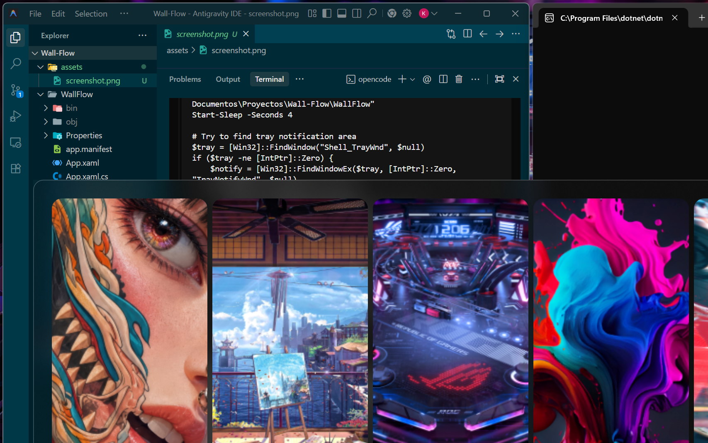

# WallFlow


Gestor de fondos de pantalla minimalista para Windows con integración en la bandeja del sistema.

<p align="center">
  
</p>

## Características

- **Exploración visual** — Navegación por tus wallpapers con scroll horizontal paginado
- **Establecer wallpaper** — Haz clic en cualquier wallpaper para aplicarlo al escritorio al instante
- **Autoarranque** — Opción para iniciar con Windows desde el menú contextual
- **Atajo de teclado** — `Alt + W` para mostrar/ocultar la ventana
- **Bandeja del sistema** — Icono en el área de notificaciones con menú contextual animado
- **Overlay transparente** — Interfaz semitransparente sobre el escritorio con efecto blur

<p align="center">
  
</p>

## Requisitos

- Windows 10 u 11 (x64)
- [.NET 8 Runtime](https://dotnet.microsoft.com/download/dotnet/8.0)

## Instalación

### Por comando (PowerShell)

```powershell
# Opción 1: Descargar y ejecutar el instalador automático
iwr -Uri 'https://github.com/Sciclox/Wall-Flow/releases/latest/download/install.ps1' -OutFile install.ps1
.\install.ps1

# Opción 2: Una línea (descarga, extrae y ejecuta)
iwr -Uri 'https://github.com/Sciclox/Wall-Flow/releases/latest/download/WallFlow-v1.0.0.zip' -OutFile WallFlow.zip
Expand-Archive -Path WallFlow.zip -DestinationPath "$env:LOCALAPPDATA\WallFlow" -Force
& "$env:LOCALAPPDATA\WallFlow\WallFlow.exe"
```

### Manual

1. Descarga `WallFlow-v1.0.0.zip` desde [Releases](https://github.com/Sciclox/Wall-Flow/releases)
2. Extrae el archivo en cualquier carpeta
3. Ejecuta `WallFlow.exe`

### Configuración de directorio

Por defecto busca wallpapers en:

```
C:\Users\%USERNAME%\OneDrive\Imágenes\Wallpapers
```

Para usar un directorio personalizado, crea un archivo `wallflow.txt` junto al ejecutable con la ruta de tu carpeta de wallpapers.

## Uso

| Acción | Resultado |
|--------|-----------|
| Clic en wallpaper | Establece como fondo de pantalla |
| Scroll horizontal | Navega entre páginas de wallpapers |
| `Alt + W` | Muestra/oculta la ventana |
| Clic derecho en ícono de bandeja | Abre menú contextual |
| Clic izquierdo en ícono de bandeja | Activa la ventana |
| `Escape` | Cierra la ventana |

## Compilación desde código

```powershell
git clone https://github.com/Sciclox/Wall-Flow.git
cd Wall-Flow/WallFlow
dotnet build -c Release
```

## Licencia

MIT
